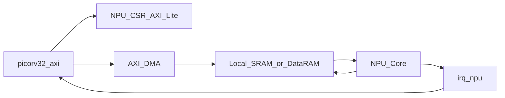

# NPU（当前项目策略）

## 结论先说

在你们当前赛题阶段（手写数字识别、模型规模较小），**可以先不用 DDR，采用片上 SRAM 方案**，并且能完成功能验收与基础性能验证。  
DDR 不是“能不能做出来”的前提，而是“冲更高吞吐/更大模型”的扩展项。

## 当前推荐架构

说明：
- 控制面：CPU 通过 AXI-Lite 配置 NPU。
- 数据面：DMA 负责搬运，NPU 核心通过本地 SRAM 端口读写。
- 这样做能把“总线突发优化”与“计算核心设计”解耦，便于并行推进。

## 什么时候必须上 DDR

- 模型和中间特征图明显超出片上 BRAM/URAM 容量。
- 目标吞吐率需要持续大带宽流数据。
- 需要展示更高总线带宽利用率和系统级扩展能力。

## 当前阶段必须做好的事

- NPU 控制面寄存器冻结（先统一接口，再并行开发）。
- NPU 与 DMA 的任务时序闭环：`搬运 -> 计算 -> 回写 -> 中断/状态`。
- 一键回归可跑通 PASS/FAIL。

详细接口和控制面定义见：`NPU模块接口与控制面定义.md`
