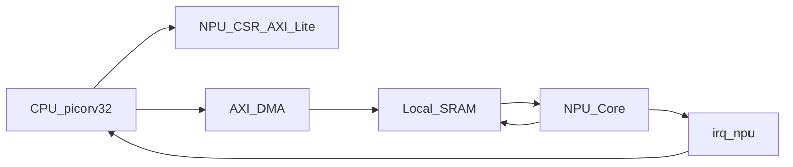
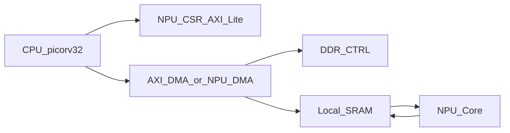

## NPU 架构图（SRAM 基线版）

### 说明（当前阶段）
- 不依赖 DDR，先用片上 SRAM 跑通赛题流程。
- DMA 负责总线突发，NPU 核心专注计算与本地 SRAM 访问。
- 这种接口更稳，便于你们团队并行开发并快速收敛。

## 扩展架构图（DDR 增强版）

### 说明（后续冲分）
- DDR 作为大容量外存，解决模型与特征图容量问题。
- 保持 NPU 核心接口不变，只替换数据来源/去向路径。
