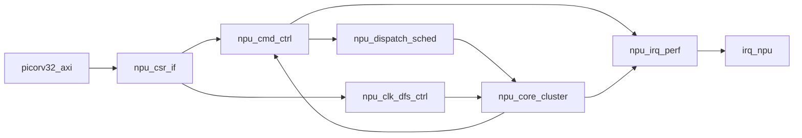

# NPU模块接口与控制面定义（达标实现版）

更新时间：`2026-03-23`

## 1. 文档目标

本文定义 NPU 的控制面“冻结规范”，用于：

- 软件驱动可直接按寄存器编程
- RTL 可直接按端口对接实现
- 验证同学可直接按状态机与计数器定义写 testbench

适配目标：赛题三基础指标（`4x4` 阵列、AXI-Lite+Burst、`>=0.5TOPS`、`>=60%` 带宽利用率、门控时钟）并预留优化指标（`>=1TOPS`、`>=80%`、DFS）。

---

## 2. 控制面总体结构

- `npu_csr_if`：AXI-Lite 寄存器终端
- `npu_cmd_ctrl`：任务状态机与参数合法性检查
- `npu_dispatch_sched`：任务切分与 cluster 派发
- `npu_irq_perf`：中断与性能计数
- `npu_clk_dfs_ctrl`：门控与 DFS 控制



---

## 3. 顶层控制端口定义（`npu_ctrl_top`）

```verilog
module npu_ctrl_top (
    input  wire         clk,                  // 输入：控制面时钟
    input  wire         resetn,               // 输入：低有效复位

    // AXI-Lite CSR
    input  wire         s_axi_awvalid,        // 输入：写地址有效
    output wire         s_axi_awready,        // 输出：写地址ready
    input  wire [31:0]  s_axi_awaddr,         // 输入：写地址
    input  wire [2:0]   s_axi_awprot,         // 输入：保护属性
    input  wire         s_axi_wvalid,         // 输入：写数据有效
    output wire         s_axi_wready,         // 输出：写数据ready
    input  wire [31:0]  s_axi_wdata,          // 输入：写数据
    input  wire [3:0]   s_axi_wstrb,          // 输入：写字节使能
    output wire         s_axi_bvalid,         // 输出：写响应有效
    input  wire         s_axi_bready,         // 输入：写响应ready
    input  wire         s_axi_arvalid,        // 输入：读地址有效
    output wire         s_axi_arready,        // 输出：读地址ready
    input  wire [31:0]  s_axi_araddr,         // 输入：读地址
    input  wire [2:0]   s_axi_arprot,         // 输入：保护属性
    output wire         s_axi_rvalid,         // 输出：读数据有效
    input  wire         s_axi_rready,         // 输入：读数据ready
    output wire [31:0]  s_axi_rdata,          // 输出：读数据

    // 状态反馈（来自执行面）
    input  wire         clus_done_i,          // 输入：cluster完成
    input  wire         clus_error_i,         // 输入：cluster错误
    input  wire [31:0]  clus_err_code_i,      // 输入：cluster错误码
    input  wire         post_done_i,          // 输入：后处理完成
    input  wire         post_error_i,         // 输入：后处理错误
    input  wire         mac_event_pulse_i,    // 输入：MAC事件脉冲
    input  wire         stall_mem_pulse_i,    // 输入：访存stall脉冲
    input  wire         stall_pipe_pulse_i,   // 输入：流水stall脉冲
    input  wire         dma_data_beat_pulse_i,// 输入：DMA有效beat脉冲
    input  wire         dma_window_cyc_pulse_i,// 输入：DMA窗口周期脉冲

    // 控制输出（到执行面）
    output wire         run_start_o,          // 输出：任务启动脉冲
    output wire [7:0]   core_num_active_o,    // 输出：启用核数
    output wire [3:0]   simd_mode_o,          // 输出：SIMD模式
    output wire [3:0]   op_mode_o,            // 输出：算子模式
    output wire [3:0]   act_mode_o,           // 输出：激活模式
    output wire [31:0]  src0_base_o,          // 输出：源0基址
    output wire [31:0]  src1_base_o,          // 输出：源1基址
    output wire [31:0]  dst_base_o,           // 输出：目的基址
    output wire [15:0]  dim_m_o,              // 输出：M
    output wire [15:0]  dim_n_o,              // 输出：N
    output wire [15:0]  dim_k_o,              // 输出：K
    output wire [7:0]   stride_o,             // 输出：stride
    output wire [7:0]   pad_o,                // 输出：pad
    output wire [15:0]  qscale_o,             // 输出：量化scale
    output wire [7:0]   qshift_o,             // 输出：量化shift
    output wire [7:0]   qzp_o,                // 输出：量化zero-point

    // 功耗控制输出
    output wire         core_clk_en_o,        // 输出：core时钟使能
    output wire [1:0]   core_clk_div_sel_o,   // 输出：core分频档位

    output wire         irq_npu_o             // 输出：NPU中断
);
```

---

## 4. CSR 寄存器映射（冻结版）

建议基址：`0x5000_0000`

| Offset | 名称 | 字段定义 | 访问属性 | 说明 |
|---|---|---|---|---|
| `0x00` | `NPU_CTRL` | `bit0 start(W1P)` `bit1 soft_reset(W1P)` `bit2 irq_en` | RW | 基本控制 |
| `0x04` | `NPU_STATUS` | `bit0 busy` `bit1 done(W1C)` `bit2 error(W1C)` `bit3 irq_pending(W1C)` `bit4 idle` | RO/W1C | 任务状态 |
| `0x08` | `NPU_MODE` | `bit3:0 op_mode` `bit7:4 act_mode` | RW | 模式选择 |
| `0x0C` | `SRC0_BASE` | `31:0` | RW | 源0基址（word） |
| `0x10` | `SRC1_BASE` | `31:0` | RW | 源1基址（word） |
| `0x14` | `DST_BASE` | `31:0` | RW | 目的基址（word） |
| `0x18` | `DIM_MN` | `31:16 M` `15:0 N` | RW | 维度 |
| `0x1C` | `DIM_K` | `15:0 K` | RW | 维度 |
| `0x20` | `STRIDE_PAD` | `7:0 stride` `15:8 pad` | RW | Conv 参数 |
| `0x24` | `QNT_CFG` | `15:0 qscale` `23:16 qshift` `31:24 qzp` | RW | 量化参数 |
| `0x28` | `CORE_CFG` | `7:0 core_num_active` `11:8 simd_mode` | RW | 并行度配置 |
| `0x2C` | `POWER_CFG` | `bit0 clk_gate_en` `bit1 dfs_en` `bit3:2 dfs_level` | RW | 低功耗配置 |
| `0x30` | `ERR_CODE` | `31:0` | RO | 错误码 |
| `0x34` | `PERF_CYCLE` | `31:0` | RO | 总周期 |
| `0x38` | `PERF_MAC` | `31:0` | RO | MAC 次数 |
| `0x3C` | `PERF_STALL_MEM` | `31:0` | RO | 访存 stall |
| `0x40` | `PERF_STALL_PIPE` | `31:0` | RO | 流水 stall |
| `0x44` | `PERF_DMA_DATA_CYC` | `31:0` | RO | DMA 有效数据周期 |
| `0x48` | `PERF_DMA_WIN_CYC` | `31:0` | RO | DMA 总窗口周期 |
| `0x4C` | `CAPABILITY` | bit map | RO | 能力位（4x4/INT8/DFS 等） |
| `0x50` | `VERSION` | `31:0` | RO | 版本号 |

### 4.1 关键语义（必须实现）

- `start`、`soft_reset` 是 `W1P`，只产生单周期脉冲。
- `done/error/irq_pending` 是 `W1C`。
- `busy=1` 时再次 `start` 必须置 `error`，错误码 `ERR_BUSY_START`。
- `irq_npu = irq_en && irq_pending`（电平中断）。

---

## 5. 错误码定义（统一）

| 错误码 | 含义 |
|---|---|
| `0x0000_0000` | 无错误 |
| `0x0000_0001` | 参数非法（M/N/K 为 0） |
| `0x0000_0002` | 地址越界 |
| `0x0000_0003` | busy 重入 start |
| `0x0000_0004` | 模式不支持 |
| `0x0000_0005` | core_num_active 非法（0 或超上限） |
| `0x0000_0006` | simd_mode 非法 |
| `0x0000_00FF` | 未分类内部错误 |

---

## 6. 状态机定义

## 6.1 `npu_cmd_ctrl` 主状态机

- `IDLE`：等待 start
- `CHECK`：参数检查（维度/地址/并行度）
- `RUN`：cluster + postproc 执行
- `DONE`：完成挂起（等待 W1C）
- `ERR`：错误挂起（等待 W1C）

转移规则：

- `IDLE + start -> CHECK`
- `CHECK fail -> ERR`
- `CHECK ok -> RUN`
- `RUN + done -> DONE`
- `RUN + error -> ERR`
- `DONE/ERR + W1C or soft_reset -> IDLE`

## 6.2 `npu_dispatch_sched` 调度状态

- `SCH_IDLE`
- `SCH_ISSUE`（下发 tile 子任务）
- `SCH_WAIT`（等待 cluster 完成）
- `SCH_DONE / SCH_ERR`

---

## 7. 控制面子模块接口（逐端口）

## 7.1 `npu_csr_if`

当前实现状态：

- 已落地 RTL：`picorv32-main/picorv32-main/HDL_src/NPU_design/npu_csr_if.v`
- 已实现寄存器范围：`0x00 ~ 0x50`
- 已实现 `CAPABILITY=32'h0000_003F`
- 已实现 `VERSION=32'h2026_0323`
- `busy` 时重复 `start` 的报错动作仍由 `npu_cmd_ctrl` 消费 `cfg_start_pulse_o` 后完成，本模块不直接改写 `status/error`

```verilog
module npu_csr_if (
    input  wire         clk,                   // 输入：CSR时钟
    input  wire         resetn,                // 输入：低有效复位
    // AXI-Lite
    input  wire         s_axi_awvalid,         // 输入：写地址有效
    output wire         s_axi_awready,         // 输出：写地址ready
    input  wire [31:0]  s_axi_awaddr,          // 输入：写地址
    input  wire [2:0]   s_axi_awprot,          // 输入：保护属性
    input  wire         s_axi_wvalid,          // 输入：写数据有效
    output wire         s_axi_wready,          // 输出：写数据ready
    input  wire [31:0]  s_axi_wdata,           // 输入：写数据
    input  wire [3:0]   s_axi_wstrb,           // 输入：字节使能
    output wire         s_axi_bvalid,          // 输出：写响应有效
    input  wire         s_axi_bready,          // 输入：写响应ready
    input  wire         s_axi_arvalid,         // 输入：读地址有效
    output wire         s_axi_arready,         // 输出：读地址ready
    input  wire [31:0]  s_axi_araddr,          // 输入：读地址
    input  wire [2:0]   s_axi_arprot,          // 输入：保护属性
    output wire         s_axi_rvalid,          // 输出：读数据有效
    input  wire         s_axi_rready,          // 输入：读数据ready
    output wire [31:0]  s_axi_rdata,           // 输出：读数据
    // status/perf mirror
    input  wire         status_busy_i,         // 输入：busy镜像
    input  wire         status_done_i,         // 输入：done镜像
    input  wire         status_error_i,        // 输入：error镜像
    input  wire         status_irq_pending_i,  // 输入：irq_pending镜像
    input  wire [31:0]  err_code_i,            // 输入：错误码镜像
    input  wire [31:0]  perf_cycle_i,          // 输入：周期镜像
    input  wire [31:0]  perf_mac_i,            // 输入：MAC镜像
    input  wire [31:0]  perf_stall_mem_i,      // 输入：访存stall镜像
    input  wire [31:0]  perf_stall_pipe_i,     // 输入：流水stall镜像
    input  wire [31:0]  perf_dma_data_cyc_i,   // 输入：DMA有效周期镜像
    input  wire [31:0]  perf_dma_win_cyc_i,    // 输入：DMA窗口镜像
    // cfg out
    output wire         cfg_start_pulse_o,     // 输出：start脉冲
    output wire         cfg_soft_reset_pulse_o,// 输出：soft reset脉冲
    output wire         cfg_irq_en_o,          // 输出：irq使能
    output wire [3:0]   cfg_op_mode_o,         // 输出：op模式
    output wire [3:0]   cfg_act_mode_o,        // 输出：act模式
    output wire [31:0]  cfg_src0_base_o,       // 输出：src0
    output wire [31:0]  cfg_src1_base_o,       // 输出：src1
    output wire [31:0]  cfg_dst_base_o,        // 输出：dst
    output wire [15:0]  cfg_dim_m_o,           // 输出：M
    output wire [15:0]  cfg_dim_n_o,           // 输出：N
    output wire [15:0]  cfg_dim_k_o,           // 输出：K
    output wire [7:0]   cfg_stride_o,          // 输出：stride
    output wire [7:0]   cfg_pad_o,             // 输出：pad
    output wire [15:0]  cfg_qscale_o,          // 输出：qscale
    output wire [7:0]   cfg_qshift_o,          // 输出：qshift
    output wire [7:0]   cfg_qzp_o,             // 输出：qzp
    output wire [7:0]   cfg_core_num_active_o, // 输出：有效核数
    output wire [3:0]   cfg_simd_mode_o,       // 输出：SIMD模式
    output wire         cfg_clk_gate_en_o,     // 输出：门控使能
    output wire         cfg_dfs_en_o,          // 输出：DFS使能
    output wire [1:0]   cfg_dfs_level_o,       // 输出：DFS档位
    // W1C clear
    output wire         w1c_done_o,            // 输出：清done
    output wire         w1c_error_o,           // 输出：清error
    output wire         w1c_irq_pending_o      // 输出：清irq_pending
);
```

## 7.2 `npu_cmd_ctrl`

```verilog
module npu_cmd_ctrl (
    input  wire         clk,                  // 输入：时钟
    input  wire         resetn,               // 输入：复位
    input  wire         cfg_start_pulse_i,    // 输入：启动脉冲
    input  wire         cfg_soft_reset_pulse_i,// 输入：软复位
    input  wire [7:0]   cfg_core_num_active_i,// 输入：核数
    input  wire [3:0]   cfg_simd_mode_i,      // 输入：SIMD模式
    input  wire [3:0]   cfg_op_mode_i,        // 输入：操作模式
    input  wire [3:0]   cfg_act_mode_i,       // 输入：激活模式
    input  wire [31:0]  cfg_src0_base_i,      // 输入：src0
    input  wire [31:0]  cfg_src1_base_i,      // 输入：src1
    input  wire [31:0]  cfg_dst_base_i,       // 输入：dst
    input  wire [15:0]  cfg_dim_m_i,          // 输入：M
    input  wire [15:0]  cfg_dim_n_i,          // 输入：N
    input  wire [15:0]  cfg_dim_k_i,          // 输入：K
    input  wire [7:0]   cfg_stride_i,         // 输入：stride
    input  wire [7:0]   cfg_pad_i,            // 输入：pad
    input  wire [15:0]  cfg_qscale_i,         // 输入：qscale
    input  wire [7:0]   cfg_qshift_i,         // 输入：qshift
    input  wire [7:0]   cfg_qzp_i,            // 输入：qzp
    input  wire         exec_done_i,          // 输入：执行完成
    input  wire         exec_error_i,         // 输入：执行错误
    input  wire [31:0]  exec_err_code_i,      // 输入：执行错误码
    input  wire         w1c_done_i,           // 输入：清done
    input  wire         w1c_error_i,          // 输入：清error
    input  wire         w1c_irq_pending_i,    // 输入：清irq_pending
    output wire         run_start_o,          // 输出：运行启动
    output wire         job_valid_o,          // 输出：job有效
    output wire [7:0]   job_core_num_active_o,// 输出：job核数
    output wire [3:0]   job_simd_mode_o,      // 输出：job SIMD
    output wire [3:0]   job_op_mode_o,        // 输出：job模式
    output wire [3:0]   job_act_mode_o,       // 输出：job激活
    output wire [31:0]  job_src0_base_o,      // 输出：job src0
    output wire [31:0]  job_src1_base_o,      // 输出：job src1
    output wire [31:0]  job_dst_base_o,       // 输出：job dst
    output wire [15:0]  job_dim_m_o,          // 输出：job M
    output wire [15:0]  job_dim_n_o,          // 输出：job N
    output wire [15:0]  job_dim_k_o,          // 输出：job K
    output wire [7:0]   job_stride_o,         // 输出：job stride
    output wire [7:0]   job_pad_o,            // 输出：job pad
    output wire [15:0]  job_qscale_o,         // 输出：job qscale
    output wire [7:0]   job_qshift_o,         // 输出：job qshift
    output wire [7:0]   job_qzp_o,            // 输出：job qzp
    output wire         status_busy_o,        // 输出：busy
    output wire         status_done_o,        // 输出：done
    output wire         status_error_o,       // 输出：error
    output wire         status_irq_pending_o, // 输出：irq_pending
    output wire [31:0]  err_code_o            // 输出：错误码
);
```

## 7.3 `npu_irq_perf`

```verilog
module npu_irq_perf (
    input  wire         clk,                    // 输入：时钟
    input  wire         resetn,                 // 输入：复位
    input  wire         cfg_irq_en_i,           // 输入：irq使能
    input  wire         status_busy_i,          // 输入：busy
    input  wire         status_done_i,          // 输入：done
    input  wire         status_error_i,         // 输入：error
    input  wire         w1c_done_i,             // 输入：清done
    input  wire         w1c_error_i,            // 输入：清error
    input  wire         w1c_irq_pending_i,      // 输入：清irq
    input  wire         mac_event_pulse_i,      // 输入：MAC事件
    input  wire         stall_mem_pulse_i,      // 输入：访存stall
    input  wire         stall_pipe_pulse_i,     // 输入：流水stall
    input  wire         dma_data_beat_pulse_i,  // 输入：DMA数据周期
    input  wire         dma_window_cyc_pulse_i, // 输入：DMA窗口周期
    output wire         irq_npu_o,              // 输出：中断
    output wire [31:0]  perf_cycle_o,           // 输出：周期
    output wire [31:0]  perf_mac_o,             // 输出：MAC
    output wire [31:0]  perf_stall_mem_o,       // 输出：访存stall
    output wire [31:0]  perf_stall_pipe_o,      // 输出：流水stall
    output wire [31:0]  perf_dma_data_cyc_o,    // 输出：DMA有效周期
    output wire [31:0]  perf_dma_win_cyc_o      // 输出：DMA窗口周期
);
```

## 7.4 `npu_clk_dfs_ctrl`

```verilog
module npu_clk_dfs_ctrl (
    input  wire       clk,                 // 输入：时钟
    input  wire       resetn,              // 输入：复位
    input  wire       cfg_clk_gate_en_i,   // 输入：门控使能
    input  wire       cfg_dfs_en_i,        // 输入：DFS使能
    input  wire [1:0] cfg_dfs_level_i,     // 输入：DFS档位
    input  wire       status_busy_i,       // 输入：busy
    input  wire       dbg_force_clk_on_i,  // 输入：调试强制开时钟
    output wire       core_clk_en_o,       // 输出：时钟使能
    output wire [1:0] core_clk_div_sel_o   // 输出：分频选择
);
```

---

## 8. 算力与带宽指标的控制面口径

## 8.1 TOPS 口径

\[
TOPS = \frac{PERF\_MAC \cdot 2}{PERF\_CYCLE / f\_{clk}} \cdot 10^{-12}
\]

说明：`PERF_MAC` 计 MAC 次数，乘加按 2 ops。

## 8.2 Burst 带宽利用率口径

\[
BW\_util = \frac{PERF\_DMA\_DATA\_CYC}{PERF\_DMA\_WIN\_CYC}
\]

赛题目标：

- 基础：`BW_util >= 60%`
- 优化：`BW_util >= 80%`

---

## 9. 软件编程顺序（驱动最小流程）

1. 配置 DMA 把输入/权重搬到 local SRAM。  
2. 写 `SRC0_BASE/SRC1_BASE/DST_BASE`。  
3. 写 `DIM_MN/DIM_K/CORE_CFG/NPU_MODE/QNT_CFG`。  
4. 写 `POWER_CFG`（可启用门控/DFS）。  
5. 写 `NPU_CTRL.start=1`。  
6. 等待 `done` 或 `irq_npu`。  
7. 读 `ERR_CODE/PERF_*`；写 `W1C` 清状态。  

---

## 10. 控制面必测项（验收）

- AXI-Lite 协议：地址/数据乱序写入兼容。
- `W1P`：start/soft_reset 仅 1 周期脉冲。
- `W1C`：done/error/irq_pending 清除正确。
- busy 重入 start -> `ERR_BUSY_START`。
- 参数非法 -> 对应错误码。
- PERF 计数器在任务期间递增、soft_reset 后清零。
- irq enable/disable 两条路径行为一致。
