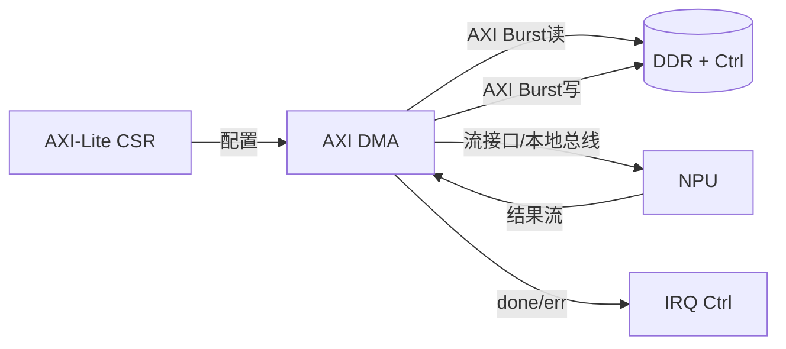
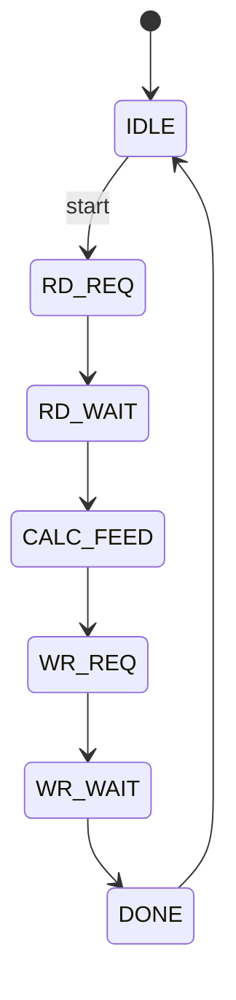

# AXI DMA

## 作用
`AXI DMA` 负责大块数据搬运，核心任务是：
- 从 DDR 读取输入特征图/权重；
- 将数据喂给 NPU；
- 把 NPU 输出写回 DDR。

它是“数据面主通道”，决定吞吐率。

## 模块关系

## 关键参数
- `burst_len`：建议优先 16/32 beat（看 DDR 控制器能力）。
- `data_width`：与 DDR 口宽匹配（例如 64/128bit）。
- `outstanding`：允许多个未完成事务提升带宽利用率。

## 建议状态机

## 验证要点
- 递增地址 burst 数据顺序正确。
- 长度非 burst 整倍数时尾包处理正确。
- 背压场景下（NPU 暂停）不丢数据、不乱序。

