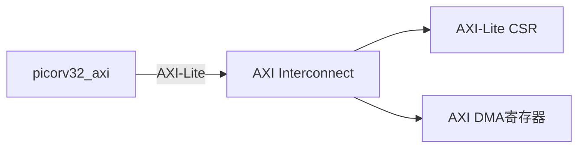

# AXI Interconnect

## 作用
AXI Interconnect 是 SoC 的“地址路由器 + 协议桥”，负责把 `picorv32_axi` 发出的 AXI-Lite 访问分发到不同从设备（如 CSR、DMA 控制寄存器）。

在完整系统里，数据面通常还会有一条单独的 AXI 全接口互连，给 DMA/NPU 访问 DDR。

## 在本 SoC 中的位置

## 关键功能
- 地址译码：根据地址前缀选择目标从设备。
- 通道握手：维持 AXI-Lite 的 `VALID/READY` 握手。
- 错误返回：非法地址返回 `DECERR/SLVERR`，避免 CPU 卡死。
- 可扩展：后续可加 UART、Timer、GPIO 的 AXI-Lite 外设窗口。

## 建议地址映射（示例）
- `0x4000_0000 ~ 0x4000_FFFF` -> [[AXI-Lite CSR]]
- `0x4001_0000 ~ 0x4001_FFFF` -> [[AXI DMA]] 控制寄存器

## 验证要点
- 同一拍只有一个从设备被选中。
- 越界地址能正确返回错误响应。
- 随机读写下 `aw/ar/w/b/r` 通道握手无死锁。
