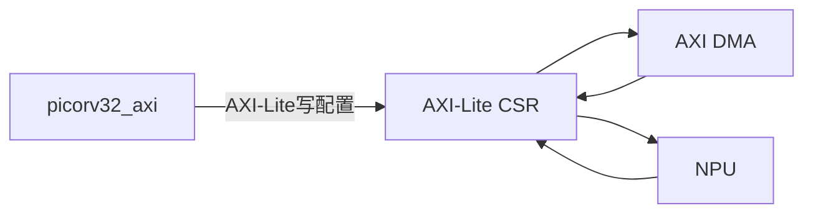

# AXI-Lite CSR

## 作用
`AXI-Lite CSR` 是控制/状态寄存器模块，提供 CPU 与 NPU/DMA 的软件控制接口。

它只传“小量控制信息”，不传大块特征图/权重数据。

## 模块关系

## 建议寄存器表（示例）
| 偏移 | 名称 | 说明 |
|---|---|---|
| `0x00` | `CTRL` | bit0:`start` bit1:`soft_reset` |
| `0x04` | `STATUS` | bit0:`busy` bit1:`done` bit2:`error` |
| `0x08` | `SRC_ADDR` | 输入数据首地址 |
| `0x0C` | `DST_ADDR` | 输出数据首地址 |
| `0x10` | `LEN` | 传输长度（byte） |
| `0x14` | `MODE` | 模式（conv/mm/pool 等） |
| `0x18` | `IRQ_EN` | 中断使能 |
| `0x1C` | `IRQ_STATUS` | 中断状态（W1C） |

## 设计建议
- `start` 只接受上升沿，硬件自动清零或由软件清零。
- `done` 由硬件置位，CPU 写 `IRQ_STATUS` 清除。
- 建议对齐检查：地址/长度非法时置 `error`。

## 验证要点
- AXI-Lite 单拍/背靠背写入都能稳定生效。
- `start -> busy -> done` 状态转换符合预期。
- `irq_en=0` 不上报中断，`irq_en=1` 正常中断。

