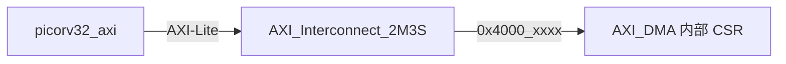

# AXI-Lite CSR（当前项目用法）

## 说明

当前 SoC 没有单独的“通用 CSR 模块”。  
目前可编程 CSR 主要在 `AXI_DMA.v` 内部实现，CPU 通过 AXI-Lite 访问 DMA 寄存器完成控制。

## 访问路径

## 当前可用 CSR 空间

- 基地址：`0x4000_0000`
- 窗口大小：`64KB`（`0x4000_0000 ~ 0x4000_FFFF`）
- 主要寄存器：
  - `CTRL / STATUS`
  - `SRC_ADDR / DST_ADDR / BYTE_LEN`
  - `ERR_CODE`
  - `PERF_CYCLE / PERF_RDWORDS / PERF_WRWORDS`
  - `BURST_WORDS`

## 语义约定

- `start`、`soft_reset`：`W1P`（写 1 脉冲）
- `done`、`error`、`irq_pending`：`W1C`（写 1 清除）
- `busy`：只读状态位

## 下一步扩展建议

- 保持 DMA CSR 地址稳定
- 为 NPU 预留独立 AXI-Lite CSR 窗口（建议 `0x5000_xxxx`）
- 统一中断状态位语义，减少软件驱动分支
