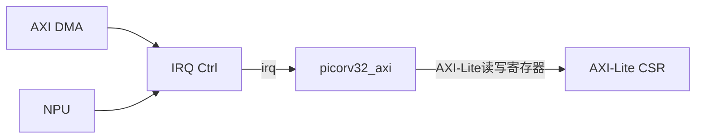

# IRQ Ctrl

## 作用
`IRQ Ctrl` 用于汇聚和管理中断，把 DMA/NPU 的完成或错误事件转成 CPU 可处理的中断信号。

## 模块关系

## 建议寄存器（可放在 CSR 空间）
| 偏移 | 名称 | 说明 |
|---|---|---|
| `0x20` | `IRQ_RAW` | 原始中断状态 |
| `0x24` | `IRQ_MASK` | 中断屏蔽 |
| `0x28` | `IRQ_PENDING` | 挂起状态 |
| `0x2C` | `IRQ_CLEAR` | 写 1 清除 |

## 逻辑建议
- `pending = raw & mask`
- 任一 `pending` 有效即拉高 `irq` 给 CPU。
- 清除采用 W1C（write one to clear），避免误清其它位。

## 验证要点
- 多源同时中断时，pending 位都能保留。
- 屏蔽位生效后不再触发 CPU 中断。
- 清除后中断线及时释放，不出现重复中断风暴。

