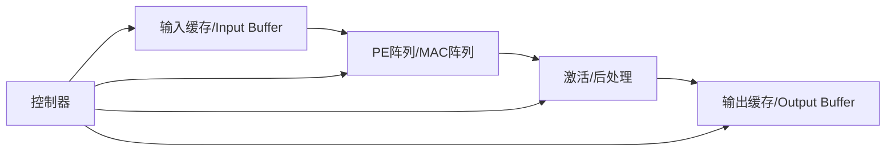

# NPU

## 作用
NPU 是专用算力模块，执行 AI 推理核心算子（如卷积、矩阵乘、激活、池化等）。

在赛题三场景中，CPU 负责调度，NPU 负责高并行计算。

## 内部结构（建议）

## SoC 连接关系

## 关键设计点
- 数据复用：尽量在片上缓存复用，减少 DDR 访问。
- 并行度：PE 阵列规模按 FPGA DSP/BRAM 资源选型。
- 量化：优先 INT8/INT16，先跑通再做混合精度。
- 可编程：通过 CSR 配置层参数（维度、步长、激活模式）。

## 验证要点
- 用 Python/NumPy 生成 golden 结果做逐层比对。
- 覆盖 corner case：边界填充、步长变化、通道不整除。
- 统计吞吐率与利用率（PE busy 周期占比）。

