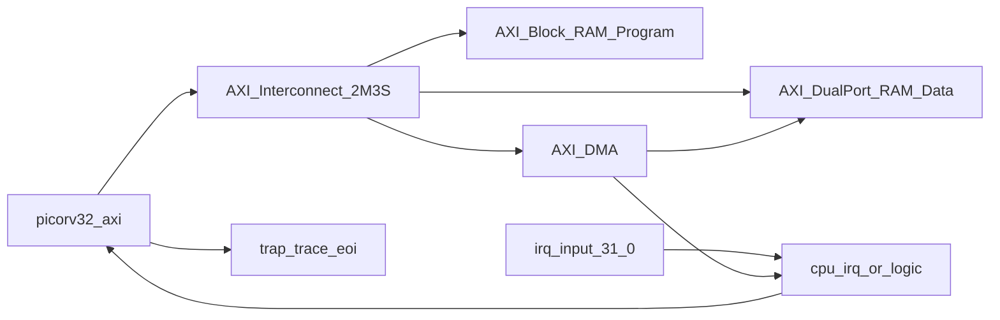

# SoC 总架构图（按当前 RTL）

更新时间：`2026-03-21`  
对应文件：`picorv32-main/picorv32-main/HDL_src/picorv32_AXI_SOC.v`

## 地址映射（已实现）

| 地址段 | 模块 | 说明 |
|---|---|---|
| `0x0000_0000 ~ 0x0000_FFFF` | Program RAM | 程序存储器（`demo.hex` 载入） |
| `0x2000_0000 ~ 0x2000_FFFF` | Data RAM | 数据存储器，CPU 走 Port-A，DMA 走 Port-B |
| `0x4000_0000 ~ 0x4000_FFFF` | DMA CSR | DMA 控制/状态寄存器窗口 |

## 当前实现状态

- 已完成：`picorv32_axi + Program RAM + Data RAM + DMA + 互连 + testbench + 一键仿真`
- 已完成：DMA Burst 读写 Data RAM（INCR 模式）
- 已完成：DMA 完成中断并并入 CPU `irq` 输入
- 未完成：NPU 计算核心接入
- 未完成：DDR 控制器接入与外存大规模搬运

## 文档导航

- [picorv32_axi](./picorv32_axi.md)
- [AXI Interconnect](./AXI%20Interconnect.md)
- [AXI DMA](./AXI%20DMA.md)
- [AXI-Lite CSR](./AXI-Lite%20CSR.md)
- NPU 文档已迁移到：`ft_3_md/飞腾杯赛题三/NPU设计/`
