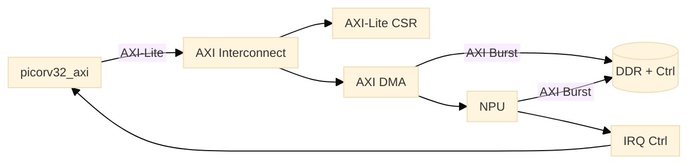

```mermaid
%%{init: {"theme":"base","themeVariables":{"fontSize":"12px"},"flowchart":{"nodeSpacing":28,"rankSpacing":34,"padding":6,"htmlLabels":false}} }%%
flowchart LR
    CPU[picorv32_axi]
    AXI[AXI Interconnect]
    CSR[AXI-Lite CSR]
    DMA[AXI DMA]
    NPU[NPU]
    IRQ[IRQ Ctrl]
    DDR[(DDR + Ctrl)]

    CPU -->|AXI-Lite| AXI
    AXI --> CSR
    AXI --> DMA
    DMA -->|AXI Burst| DDR
    DMA --> NPU
    NPU -->|AXI Burst| DDR
    NPU --> IRQ
    IRQ --> CPU

```
## 模块导航

- [[picorv32_axi]]
- [[AXI Interconnect]]
- [[AXI-Lite CSR]]
- [[AXI DMA]]
- [[NPU]]
- [[DDR + Ctrl]]
- [[IRQ Ctrl]]
